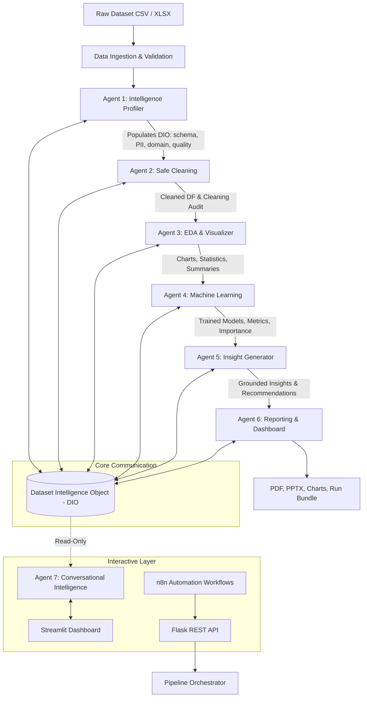
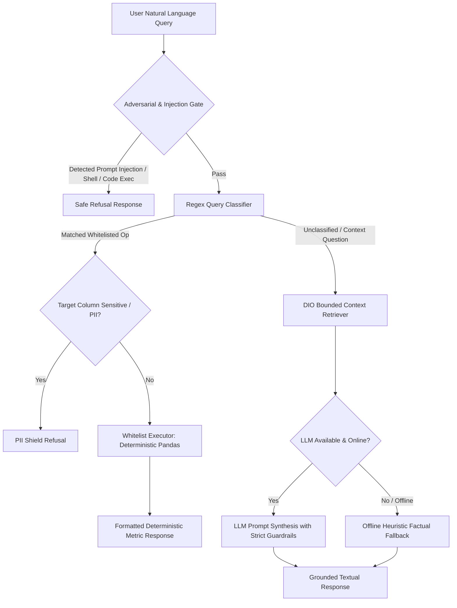

# Architecture & System Design

Autonomous Data Analyst is a multi-agent AI data analysis platform built around deterministic verification, defensive error handling, and strict data privacy.

---

## 1. High-Level Architecture Diagram

---

## 2. Agent Catalog & Responsibilities

| Agent | Responsibility | Primary Inputs | Primary Outputs | Failure Tolerance |
|-------|---------------|----------------|-----------------|-------------------|
| **Agent 1: Intelligence** | Schema profiling, semantic labeling, deterministic date resolution, regex & heuristic PII detection, domain classification, and dataset quality scoring. | Raw DataFrame | Profiling metadata, column definitions, PII labels, domain guess, quality report. | **Fatal** (Pipeline aborts if profiling fails). |
| **Agent 2: Cleaning** | Reversible, deterministic data sanitization: column normalization, whitespace stripping, missing value handling, and high-missing column drop recommendations. | Raw DataFrame, Agent 1 DIO | Cleaned DataFrame, transformation audit log, imputation notes. | **Recoverable** (Falls back to uncleaned raw DataFrame if cleaning fails). |
| **Agent 3: EDA & Viz** | Univariate, bivariate, correlation, and distribution analyses. Automated chart creation (histogram, scatter, box, bar, correlation heatmap). | Cleaned DataFrame, Agent 1 DIO | EDA statistics, static & interactive charts (Plotly/Kaleido). | **Recoverable** (Analysis continues with empty EDA metrics). |
| **Agent 4: Machine Learning** | Automated target detection, supervised classification/regression modeling, cross-validation, feature importance extraction, and compliance verification. | Cleaned DataFrame, Agent 1 DIO | Model artifacts, evaluation metrics, feature importance tables. | **Recoverable** (Skipped cleanly if no valid ML target exists or data is unsuitable). |
| **Agent 5: Insight Generator** | Business finding formulation, trend synthesis, and strategic recommendations with rigorous deterministic ground-truth verification. | All upstream DIO sections | Structured insights, recommendations, verification scores, hallucination flags. | **Recoverable** (Fallback offline heuristic insights if LLM is unreachable). |
| **Agent 6: Reporting & Dashboard** | Production of publication-grade ReportLab PDF summaries, python-pptx slide decks, and Streamlit interactive visualizations. | All DIO sections, generated charts | `report.pdf`, `presentation.pptx`, structured JSON export bundle. | **Recoverable** (Partial export if specific rendering library fails). |
| **Agent 7: Chat Agent** | Dual-tier conversational Q&A over dataset findings. Deterministic Tier 1 whitelist calculations (0 LLM, 0 code exec) and bounded Tier 2 DIO retrieval. | User query, Cleaned DataFrame, DIO | Structured conversational answer, execution status, security refusal. | **Isolated** (Read-only, never mutates analytical DIO sections or pipeline state). |

---

## 3. Dataset Intelligence Object (DIO) Contract

The **Dataset Intelligence Object (DIO)** is the single source of truth passed across all pipeline stages.

### Contract Rules & Invariants:
1. **Additive Schema:** Upstream sections written by prior agents cannot be overwritten or mutated by downstream agents.
2. **Analytical Immutability:** Once the analytical pipeline completes (Agents 1–6), analytical sections are frozen (`freeze_analytical_sections()`).
3. **Chat Read-Only Isolation:** Agent 7 and chat queries have zero write access to analytical namespaces. Chat interactions are stored strictly under `session_history`.
4. **Data Privacy Guard:** Raw sensitive personal data (PII) is never written to LLM prompt payloads, log files, or unmasked exports.
5. **Serialization:** The entire DIO must be JSON-serializable to allow reproducibility and disk persistence.

---

## 4. Dual-Tier Chat Architecture (Agent 7)

### Whitelisted Operations (Tier 1):
All Tier 1 queries execute against hardcoded, deterministic pandas aggregation functions:
- `mean`
- `sum`
- `median`
- `std` (sample standard deviation, `ddof=1`)
- `variance` (sample variance, `ddof=1`)
- `min`
- `max`
- `count`
- `value_counts`
- `groupby_mean`
- `groupby_sum`

Zero `eval()`, zero `exec()`, zero dynamic module loading.

---

## 5. Automation & Integration Architecture (n8n + REST API)

For autonomous execution in enterprise automation platforms, the system provides a lightweight Flask REST API (`api.py`):

- `GET /health`: Healthcheck, uptime, and system capability report.
- `POST /analyze`: Secure analysis trigger accepting dataset filepath or uploaded data.
- `GET /runs/<run_id>`: Execution status (`queued`, `running`, `completed`, `partial`, `failed`).
- `GET /runs/<run_id>/artifacts`: Metadata of generated reports, charts, and summary JSON.

The n8n workflow nodes communicate over standard HTTP with structured JSON schemas, enabling scheduled batch runs, webhook-triggered dataset processing, and multi-channel notification.
