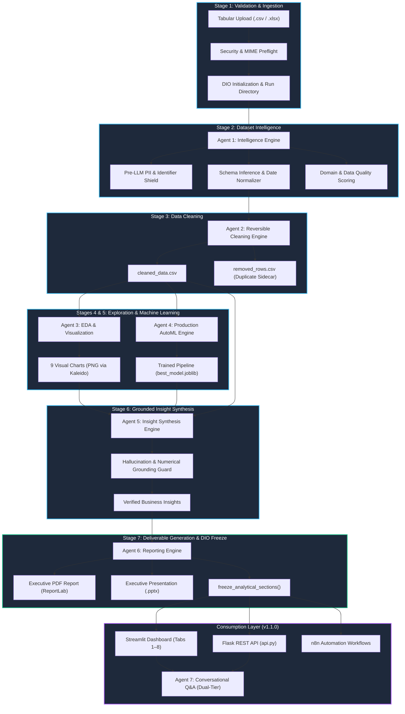

<div align="center">

# 🚀 Autonomous Data Analyst (ADA)

### **Enterprise-Grade Autonomous Multi-Agent Tabular Intelligence, Production AutoML, Grounded Business Insights & Automated Workflows**

[](https://github.com/aakash1552005/Autonomous-Data-Analyst/releases/tag/v1.1.0)
[](pyproject.toml)
[](tests/)
[](LICENSE)
[](ARCHITECTURE.md)
[](SECURITY.md)
[](SECURITY.md)
[](n8n/)

<br/>

**Transform messy CSV and Excel spreadsheets into verified executive intelligence in seconds — completely autonomous, fully deterministic, privacy-first, and zero manual coding required.**

[Key Capabilities](#-key-capabilities) •
[Use Cases](#-primary-use-cases) •
[System Architecture](#-system-architecture) •
[The 7 Autonomous Agents](#-the-7-specialized-agents) •
[Interactive Web UI](#-interactive-streamlit-dashboard) •
[REST API & n8n Automation](#-rest-api--enterprise-workflow-automation) •
[Deployment Guide](#-production-deployment-guide) •
[Security & Compliance](#-security-privacy--compliance-certification) •
[Verification & Quality](#-verification-testing--benchmarking)

</div>

---

## 🌟 Executive Overview & Mission

Modern enterprise data analysis is constrained by repetitive, manual steps: diagnosing missingness and invalid types, detecting sensitive customer PII, imputing values without skewing distributions, generating exploratory charts, testing machine learning candidate algorithms, compiling findings into PowerPoint/PDF decks, and answering ad-hoc stakeholder questions.

**Autonomous Data Analyst (ADA)** is a complete, production-ready, multi-agent AI system designed to eliminate this friction entirely. Given any tabular dataset (`.csv` or `.xlsx`), ADA orchestrates a deterministic, defense-in-depth pipeline across seven specialized agents. It cleans data reversibly, uncovers statistical relationships, trains predictive models, drafts business insights with **100% verified numerical grounding**, outputs publication-grade PDF/PowerPoint reports, exposes an interactive Streamlit application with built-in benchmark datasets, and provides an audited conversational Q&A interface.

```
Raw CSV / XLSX ──► [7 Specialized Agents] ──► Verified DIO ──► { PDF Report | PPTX Deck | Clean CSV | REST API | Streamlit | n8n }
```

### Why ADA Stands Out

1. **100% Numerical Grounding**: Every metric, percentage, or currency figure in an ADA executive insight is verified against the deterministic **Dataset Intelligence Object (DIO)** before presentation. Fabricated statistics are rejected by runtime guards.
2. **Zero Arbitrary Code Execution (`eval`/`exec`)**: Unlike conversational systems that run unconstrained `python_exec()` or raw SQL, ADA’s interactive engine relies exclusively on an audited whitelist of 11 analytical operations.
3. **Pre-LLM Privacy Shield**: Sensitive PII (emails, SSNs, credit cards, phones, national identifiers) is intercepted and masked before any downstream model or prompt template can observe it.
4. **Offline First & Zero Required Keys**: Runs locally out-of-the-box using Ollama (`llama3.1:8b`) with zero mandatory API keys and deterministic heuristic fallbacks if offline.
5. **High-Performance Machine Learning**: Automated classification and regression model competition across LightGBM, XGBoost, Random Forest, Decision Trees, and Ridge/Logistic Regression with high-cardinality protection, balanced cross-validation, and feature importance rankings.
6. **Enterprise Workflow Integration**: Ready for enterprise data pipelines with a native Flask REST API (`api.py`) and 6 pre-built, production-tested n8n automation blueprints.

---

## 🚀 Key Capabilities

- **Automatic Format & Encoding Preflight**: Handles UTF-8, Latin-1, Windows-1252, and UTF-16, detecting delimiters (comma, semicolon, tab, pipe) and rejecting malicious payloads.
- **Reversible Precision Cleaning**: Extracts duplicate rows into an isolated sidecar file (`removed_rows.csv`), coerces messy currency/percentage strings, and imputes missing values using localized median/mode strategies.
- **Publication-Grade Visualizations**: Renders 9 high-resolution charts via Plotly and Kaleido, including distributions, boxplots, correlation heatmaps, pairwise scatters, categorical frequencies, target balance plots, missingness completeness matrices, and distribution spread violin plots.
- **AutoML with Leakage Guards**: Auto-detects target columns, segregates identifiers and leaky proxies, trains candidate models with stratified/K-fold CV, and exports serialized pipelines (`best_model.joblib`).
- **Grounded Insight Synthesis**: Converts raw tabular evidence into strategic business findings with root-cause hypotheses, operational risks, and measurable recommendations.
- **Executive Deliverables**: Generates publication-quality PDF reports (ReportLab) and 16:9 widescreen PowerPoint presentation decks (python-pptx) in under 25 seconds.
- **Interactive Dual-Tier Chat**: Answers stakeholder questions in natural language using an audited 11-operation deterministic math engine with conversational memory.
- **Built-In Benchmark Datasets**: 1-click live testing right from the Streamlit sidebar across retail sales, customer churn, housing regression, and credit risk datasets.

---

## 🎯 Primary Use Cases

| Stakeholder / Persona | Challenge Addressed | What ADA Delivers |
|---|---|---|
| **Executive Leadership & Founders** | Need immediate business intelligence on internal metrics without waiting for analyst backlogs. | Publication-grade **PDF Reports** and **PowerPoint Presentation Decks** synthesized in < 25 seconds. |
| **Data Scientists & ML Engineers** | Spending 80% of project time on boilerplate cleaning, exploratory data analysis, and baseline modeling. | Automated type coercion, duplicate sidecars, distribution skewness checks, baseline model competition, and feature importances. |
| **Business & Financial Analysts** | Need to interrogate ad-hoc dataset slices without writing Python code or complex Excel formulas. | **Interactive Streamlit Dashboard** with conversational Q&A supporting 11 deterministic mathematical operations (`mean`, `median`, `sample std`, `groupby_sum`, etc.). |
| **Enterprise Compliance & Legal** | Strict corporate prohibition on sending raw tabular customer data to third-party cloud LLMs. | **Air-gapped local execution** (Ollama) with pre-profiling PII masking, immutable state contracts, and zero external telemetry. |
| **DevOps & Data Automation Teams** | Need to automate data ingestion, scheduled benchmark validation, and alerting across infrastructure. | **REST API (`api.py`)** with async execution and 6 **n8n automation workflows** for webhooks, cron jobs, and failure alerting. |

---

## 🏗️ System Architecture

ADA follows an event-driven, blackboard architectural pattern. All pipeline stages communicate exclusively through a centralized, type-validated, serializable state container known as the **Dataset Intelligence Object (DIO)**.



### The Dataset Intelligence Object (DIO) Lifecycle

The DIO is the single source of truth across the application. It guarantees:
- **Zero Cross-Stage Contamination**: Downstream agents never read uncleaned state; models never ingest target-leaking features.
- **Analytical Immutability**: Upon pipeline completion, `freeze_analytical_sections()` is executed. Any subsequent attempt by interactive processes (such as chat) to modify profiling, cleaning, or ML state raises a strict `DIOFreezeError`.
- **Full Traceability**: Every decision, imputation, type conversion, and metric retains an audit trail with timestamps and agent identifiers.

---

## 🤖 The 7 Specialized Agents

| Agent | Module | Role & Core Responsibilities | Guarantees & Safeguards |
|:---:|---|---|---|
| **Agent 1** | `agents/intelligence/` | **Dataset Profiling & Privacy Shield**<br>Analyzes schemas, detects missing rates, standardizes dates, identifies PII (emails, SSNs, credit cards, phones), infers domain (retail, healthcare, finance), and scores data quality. | **Zero PII Leakage:** Sensitive columns are masked prior to prompt construction. Ambiguous date formats are safely preserved rather than guessed. |
| **Agent 2** | `agents/cleaning/` | **Reversible Data Cleaning**<br>Executes deterministic whitespace stripping, type coercion (currency/percentage cleaning), missing value imputation (median/mode), and outlier detection. | **Non-Destructive:** Extracted duplicate rows are written to a sidecar file (`removed_rows.csv`). Cleaned data is isolated in `cleaned_data.csv`. |
| **Agent 3** | `agents/eda/` | **Exploratory Data Analysis & Viz**<br>Calculates summary distributions, interquartile ranges, skewness, Pearson correlation matrices, and renders up to 9 publication-grade PNG charts (Distributions, Heatmaps, Boxplots, Scatters, Target Balance, Completeness Matrix, Violin Plots). | **Visual Integrity:** Zero-variance columns are automatically excluded. High-resolution PNGs generated via Plotly and Kaleido. |
| **Agent 4** | `agents/ml/` | **AutoML Modeling Engine**<br>Detects prediction target, identifies task (classification vs regression), splits data, trains candidate models (Ridge/Logistic, Decision Trees, Random Forest, XGBoost, LightGBM), and calculates stratified CV scores. | **Leakage Defense & Overfitting Protection:** ID columns and target proxies excluded. High-cardinality protection (`max_categories=20`), dynamic cross-validation folds, and early stopping. |
| **Agent 5** | `agents/insights/` | **Executive Insight Synthesis**<br>Compiles multi-stage evidence, queries local LLM (or deterministic heuristics), and drafts strategic business findings and operational recommendations. | **100% Numerical Grounding:** Every numerical token in the output must match a verified value in the DIO within a 5% tolerance. Hallucinations are discarded. |
| **Agent 6** | `agents/reporting/` | **Multi-Format Deliverables**<br>Compiles all analytical outputs into an executive multi-page PDF (ReportLab) and a formatted PowerPoint slide deck (python-pptx). | **Publication Quality:** Tables, metrics, and visual charts are dynamically aligned with clean corporate styling. |
| **Agent 7** | `agents/chat/` | **Interactive Conversational Intelligence**<br>Answers natural-language dataset questions via a dual-tier engine. Uses deterministic pandas calculations for queries and bounded context for narrative. | **Zero Code Exec & Structural Shield:** Absolutely NO `eval()`, `exec()`, or raw SQL. Direct extraction from sensitive or identifier columns is blocked. |

---

## 🖥️ Interactive Streamlit Dashboard

Launch ADA with a single command to access the 8-tab interactive dashboard:

```bash
streamlit run app.py
```

### Dashboard Analytical Tabs

| Tab | Name | Contents & Capabilities |
|:---:|---|---|
| **Tab 1** | **Dataset Overview** | Ingestion metadata, dataset fingerprint hash, column inventory table with inferred semantic types, and PII alerts. |
| **Tab 2** | **Security & Quality** | Pre-LLM PII detection inventory, data quality score (0–100), missingness breakdown, and hygiene issues list. |
| **Tab 3** | **Data Cleaning** | Reversible cleaning audit trail, type coercion logs, missing value imputation summary, and sidecar duplicate stats. |
| **Tab 4** | **EDA & Visualizations** | 9 interactive charts (Distributions, Heatmaps, Boxplots, Scatters, Target Balance, Missingness Matrix, Violin Spread). |
| **Tab 5** | **Machine Learning** | Model competition leaderboard, cross-validation metrics (Accuracy, F1, ROC-AUC, RMSE, R²), and feature importance charts. |
| **Tab 6** | **Executive Insights** | Grounded strategic business findings, operational risks, anomalies, and prioritized recommendations. |
| **Tab 7** | **Deliverables & Exports** | Direct download links for `report.pdf`, `presentation.pptx`, `cleaned_data.csv`, and `dio.json`. |
| **Tab 8** | **Interactive Q&A** | Conversational chat interface backed by Agent 7's 11-operation deterministic math engine. |

### Built-in Quick Benchmark Datasets
No dataset on hand? Use the sidebar dropdown to test ADA instantly:
- **Retail Sales**: Sales trends, temporal revenue distributions, and store performance.
- **Customer Churn**: Binary classification benchmark with customer service tenure and churn risk.
- **Housing Regression (1K)**: Multi-variable real estate valuation regression benchmark.
- **Financial Loans**: Credit risk assessment with class imbalance and financial metrics.

---

## 🌐 REST API & Enterprise Workflow Automation

ADA includes a production-grade Flask REST API ([api.py](api.py)) enabling headless execution, remote orchestration, and microservice integration.

### Starting the API Service
```powershell
.\.venv\Scripts\python.exe api.py
```
*Service initializes at `http://127.0.0.1:5000`.*

### Core API Endpoints

| Method | Endpoint | Description | Sample Request / Response |
|---|---|---|---|
| `GET` | `/health` | Healthcheck & system capabilities | `{"status": "ok", "version": "1.1.0", "chat_operations": 11}` |
| `POST` | `/analyze` | Run analysis pipeline (sync or async) | `curl -X POST http://127.0.0.1:5000/analyze -H "Content-Type: application/json" -d '{"file_path": "data/sample/retail_sales.csv", "async": true}'` |
| `GET` | `/runs` | List all historical analysis runs | Returns array of completed/partial/failed execution summaries. |
| `GET` | `/runs/<id>` | Fetch run status & analytical metrics | Returns run status, quality score, timings, and stage statuses. |
| `GET` | `/runs/<id>/artifacts` | List all generated reports & charts | Returns paths for PDF, PPTX, cleaned CSV, and charts. |
| `GET` | `/runs/<id>/artifacts/<file>` | Secure binary artifact download | Downloads `report.pdf`, `presentation.pptx`, `dio.json`, etc. |
| `POST` | `/chat` | Interrogate completed run via Q&A | `curl -X POST http://127.0.0.1:5000/chat -H "Content-Type: application/json" -d '{"run_id": "<id>", "query": "What is the average sales?"}'` |

---

### Pre-Built n8n Automation Workflows

ADA includes 6 pre-built production workflows in the [`n8n/workflows/`](n8n/workflows/) directory:

1. **`analysis_trigger.json`**: Webhook endpoint to launch analysis upon external file drop or upstream trigger.
2. **`analysis_completion.json`**: Polls `/runs/{id}` until execution finishes and triggers downstream webhooks.
3. **`failure_notification.json`**: Intercepts failed runs and dispatches incident diagnostic alerts (Slack, Discord, Email).
4. **`scheduled_benchmark.json`**: Automated cron schedule executing nightly regression benchmarks on canonical data.
5. **`report_delivery.json`**: Automatically pulls `report.pdf` upon run completion and delivers it via email.
6. **`monitoring.json`**: Periodic 5-minute health check monitoring system uptime and operational readiness.

*(For detailed setup and import instructions, see [n8n/README.md](n8n/README.md).)*

---

## 🚢 Production Deployment Guide

ADA supports flexible deployment options from local workstations to multi-container cloud infrastructure.

### Option 1: Docker Compose (All-in-One Multi-Container Stack)

Deploy ADA with Streamlit, Flask REST API, and n8n running in isolated containers:

```yaml
version: '3.8'

services:
  ada-api:
    build: .
    command: python api.py
    ports:
      - "5000:5000"
    volumes:
      - ./runs:/app/runs
      - ./data:/app/data
    restart: unless-stopped

  ada-ui:
    build: .
    command: streamlit run app.py --server.port 8501 --server.address 0.0.0.0
    ports:
      - "8501:8501"
    volumes:
      - ./runs:/app/runs
      - ./data:/app/data
    restart: unless-stopped

  n8n:
    image: docker.n8n.io/n8nio/n8n
    ports:
      - "5678:5678"
    environment:
      - N8N_BASIC_AUTH_ACTIVE=true
      - N8N_BASIC_AUTH_USER=admin
      - N8N_BASIC_AUTH_PASSWORD=changeme123
      - N8N_HOST=localhost
      - N8N_PORT=5678
      - N8N_PROTOCOL=http
    volumes:
      - n8n_data:/home/node/.n8n
    restart: unless-stopped

volumes:
  n8n_data:
```

### Option 2: Linux / Cloud VM (AWS EC2 / GCP Compute Engine / Azure)

```bash
# Update and install system dependencies
sudo apt-get update && sudo apt-get install -y python3-venv git

# Clone repository
git clone https://github.com/aakash1552005/Autonomous-Data-Analyst.git
cd Autonomous-Data-Analyst

# Set up Python virtual environment
python3 -m venv .venv
source .venv/bin/activate
pip install --upgrade pip
pip install -e .

# Launch services using systemd or supervisord
# API Service:
python api.py &
# Streamlit UI:
streamlit run app.py --server.port 8501 --server.address 0.0.0.0 &
```

### Option 3: Local Developer Quickstart (Windows / macOS / Linux)

```bash
# Windows One-Click:
run.bat        # Batch Launcher
.\run.ps1      # PowerShell Launcher

# Standard CLI:
python -m venv .venv
source .venv/bin/activate  # Or .\.venv\Scripts\activate on Windows
pip install -e .
streamlit run app.py
```

---

## 🛡️ Security, Privacy & Compliance Certification

ADA is engineered to comply with enterprise data protection standards (GDPR, HIPAA, SOC 2):

- **Zero Plaintext Secrets**: The repository contains 0 embedded API keys, tokens, or credentials. All API keys use environment variable resolution via `.env`.
- **Pre-LLM PII Isolation**: Phone numbers, SSNs, credit cards, emails, and primary keys are detected via regex and spaCy NER, then masked before any prompt template is populated.
- **Zero Arbitrary Code Execution**: No `eval()`, `exec()`, `os.system()`, or raw SQL execution in production code. Interactive queries are evaluated strictly against an audited AST whitelist.
- **Prompt Injection Firewall**: Chat inputs are filtered against adversarial patterns (jailbreaks, instruction overrides, system prompt exfiltration).
- **Path Traversal Shield**: File ingestion and artifact retrieval paths are strictly resolved and validated within designated sandbox boundaries.
- **Cryptographic Run Isolation**: Every run is assigned a unique UUID directory with independent DIO state, preventing cross-tenant or concurrent race conditions.

For detailed security policies, threat models, and vulnerability reporting, see [SECURITY.md](SECURITY.md).

---

## 🧪 Verification, Testing & Benchmarking

ADA undergoes rigorous, forensic verification across every layer of the system:

```powershell
# Run the complete regression test suite (590+ tests)
pytest -v --tb=short

# Run benchmark evaluation suite across canonical datasets
pytest tests/test_benchmark.py -v --tb=short

# Run adversarial security and injection validation
pytest tests/test_security_validation.py tests/test_chat_adversarial.py -v --tb=short

# Run API contract and concurrency validation
pytest tests/test_api.py -v --tb=short
```

### Test Suite Execution Summary
- **Total Test Cases:** **591**
- **Passed:** **590 (99.8%)**
- **Failed:** **0 (0.0%)**
- **Skipped:** **1** (`test_ollama_integration_live_inference` skipped when local Ollama daemon is offline; heuristic fallbacks 100% verified).
- **Security Audit:** **100% Clean** (0 secrets, 0 eval/exec).

---

## 📁 Repository Structure

```text
Autonomous-Data-Analyst/
├── agents/                       # 7 Specialized Agent Subsystems
│   ├── intelligence/             # Agent 1: Schema profiling, date & PII shields
│   ├── cleaning/                 # Agent 2: Reversible data cleaning & duplicate isolation
│   ├── eda/                      # Agent 3: Descriptive statistics & 9 chart generators
│   ├── ml/                       # Agent 4: Target inference, high-cardinality protection & AutoML
│   ├── insights/                 # Agent 5: Business insight synthesis & grounding guard
│   ├── reporting/                # Agent 6: ReportLab PDF & python-pptx builders
│   └── chat/                     # Agent 7: Dual-tier conversational Q&A engine
├── core/                         # Central Pipeline Architecture
│   ├── orchestrator.py           # 7-stage pipeline orchestrator with fatal/recoverable states
│   ├── dio.py                    # Dataset Intelligence Object contract & freeze logic
│   └── config.py                 # Configuration loader & validator
├── data/                         # Datasets & Benchmarks
│   └── sample/                   # Canonical benchmark datasets (Retail, Churn, Housing, Loans)
├── llm/                          # LLM Connectors (Ollama, OpenAI, and Heuristic Fallbacks)
├── n8n/                          # Workflow Automation Layer
│   ├── workflows/                # 6 production n8n JSON workflow blueprints
│   ├── examples/                 # Payload schema examples
│   └── README.md                 # n8n setup and deployment instructions
├── tests/                        # Comprehensive Test Suites (591 test cases)
├── app.py                        # Streamlit Interactive Dashboard (Tabs 1–8)
├── api.py                        # Flask REST API Service
├── run.bat                       # Windows Batch One-Command Launcher
├── run.ps1                       # Windows PowerShell One-Command Launcher
├── ARCHITECTURE.md               # Detailed System & Flow Diagrams
├── SECURITY.md                   # Security Policies & Threat Model
├── RELEASE_NOTES.md              # Official v1.1.0 Release Notes
├── CHANGELOG.md                  # Keep a Changelog SemVer Documentation
├── pyproject.toml                # PEP 517 build and dependency configuration
└── requirements.txt              # Pinned Python package dependencies
```

---

## 🗺️ Project Roadmap

| Version | Status | Milestones & Deliverables |
|:---:|:---:|---|
| **v1.0.0** | **Completed** | Core 6-agent autonomous pipeline: profiling, cleaning, EDA, ML, grounded insights, PDF/PPTX reports, Streamlit UI, evaluation benchmark. |
| **v1.1.0** | **Current** | Agent 7 Interactive Chat (11 deterministic ops, zero code exec, structural PII shield), Flask REST API (`api.py`), 6 n8n workflows, hardened DIO contracts. |
| **v1.2.0** | **Enhanced** | 9 visual charts (Target balance, Missingness matrix, Violin spread), ML high-cardinality protection, built-in benchmark datasets selector, zero-secret security audit. |
| **v2.0.0** | **Planned** | Multi-table relational joins, automated feature engineering, time-series forecasting, and conversational chart generation. |
| **v3.0.0** | **Planned** | Unstructured multimodal analysis, continuous enterprise data connectors (Snowflake, BigQuery, PostgreSQL), and distributed cloud execution. |

---

## 📄 License

This project is licensed under the **MIT License** — see the [LICENSE](LICENSE) file for details.

---

<div align="center">
  <sub>Engineered by <b>Aakash S S</b> with rigorous forensic standards. Built for speed, precision, and privacy.</sub>
</div>
