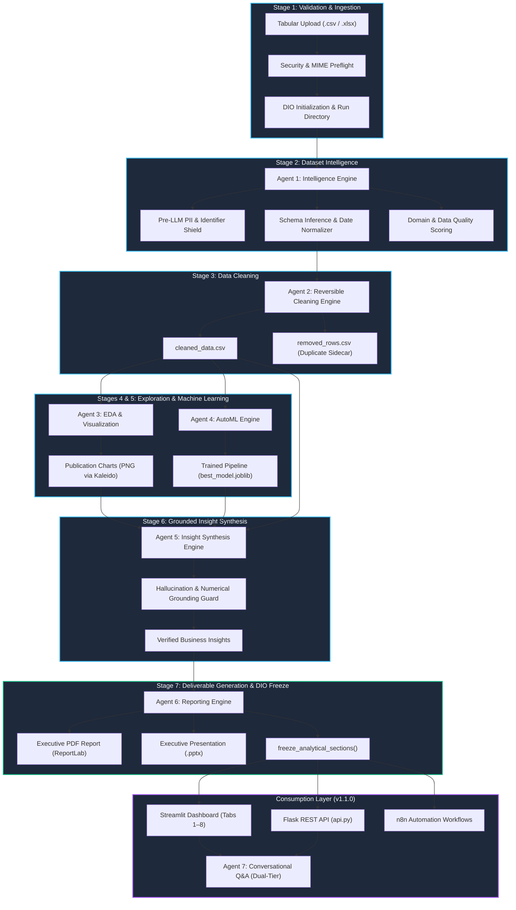

<div align="center">

# 🚀 Autonomous Data Analyst (ADA)

### **Autonomous Multi-Agent Tabular Intelligence, Automated Machine Learning, Grounded Insights & Workflow Automation**

[](https://github.com/aakash1552005/Autonomous-Data-Analyst/releases/tag/v1.1.0)
[](pyproject.toml)
[](tests/)
[](LICENSE)
[](ARCHITECTURE.md)
[](SECURITY.md)
[](SECURITY.md)

<br/>

**Transform raw CSV and Excel spreadsheets into verified executive deliverables in seconds — completely autonomous, fully deterministic, private, and zero manual coding required.**

[Key Features](#-key-features) •
[Use Cases](#-use-cases) •
[System Architecture](#-system-architecture) •
[The 7 Specialized Agents](#-the-7-specialized-agents) •
[What We Built (Phases 0–24)](#-complete-implementation-chronicle-phases-024) •
[Quick Start](#-quick-start) •
[REST API & n8n](#-rest-api--workflow-automation-n8n) •
[Verification & Quality](#-verification-testing--benchmarking)

</div>

---

## 🌟 Executive Overview & Purpose

Modern data analysis is bottlenecked by repetitive workflows: diagnosing data hygiene, checking for sensitive PII, imputing missing values, generating exploratory charts, testing machine learning candidates, distilling findings into executive PowerPoint/PDF reports, and answering ad-hoc stakeholder questions.

**Autonomous Data Analyst (ADA)** is a complete, multi-agent AI system designed to eliminate this friction entirely. Given any tabular dataset (`.csv` or `.xlsx`), ADA orchestrates a deterministic, defense-in-depth pipeline across seven specialized agents. It cleans data reversibly, uncovers statistical relationships, trains predictive models, drafts business insights with **100% verified numerical grounding**, outputs publication-grade PDF/PowerPoint reports, exposes an interactive Streamlit application, and provides an audited conversational Q&A interface.

### Why ADA is Different:

1. **Zero Hallucination Grounding**: Every number in an ADA executive insight is verified against the deterministic **Dataset Intelligence Object (DIO)** before presentation. Fabricated statistics are rejected by runtime guards.
2. **Deterministic Whitelist Execution**: Unlike conversational systems that run arbitrary `python_exec()`, `eval()`, or raw SQL, ADA’s interactive engine relies exclusively on an audited whitelist of 11 analytical operations.
3. **Pre-LLM Privacy Shield**: Sensitive PII (emails, SSNs, credit cards, phones, national identifiers) is intercepted and masked before any downstream model or prompt template can observe it.
4. **Offline First & Free**: Runs locally out-of-the-box using Ollama (`llama3.1:8b`) with zero required API keys and full offline heuristic fallbacks.
5. **Headless Enterprise Automation**: Ready for external orchestrators with a native Flask REST API (`api.py`) and 6 pre-built n8n workflow blueprints.

---

## 🎯 Primary Use Cases

| Persona / Context | Problem Solved | What ADA Delivers |
|---|---|---|
| **Executive Leadership & Founders** | Need immediate business intelligence on internal metrics without waiting for analyst queues. | Publication-grade **PDF Reports** and **PowerPoint Presentation Decks** synthesized in < 25 seconds. |
| **Data Scientists & ML Engineers** | Spending 80% of project time on boilerplate cleaning, exploratory data analysis, and baseline modeling. | Automated type coercion, duplicate sidecars, distribution skewness checks, baseline model competition (Linear/Tree/Forest/XGBoost), and feature importances. |
| **Business & Financial Analysts** | Need to interrogate ad-hoc dataset slices without writing Python code or complex Excel pivot tables. | **Interactive Streamlit Dashboard** with conversational Q&A supporting 11 deterministic mathematical operations (`mean`, `median`, `sample std`, `groupby_sum`, etc.). |
| **Enterprise Data Compliance** | Strict corporate or legal prohibition on sending raw tabular customer data to third-party cloud LLMs. | **Air-gapped local execution** (Ollama) with pre-profiling PII masking, immutable state contracts, and zero external telemetry. |
| **DevOps & Data Automation Teams** | Need to automate data ingestion, scheduled benchmark validation, and alerting across infrastructure. | **REST API (`api.py`)** with async execution and 6 **n8n automation workflows** for webhooks, cron jobs, and failure alerting. |

---

## 🏗️ System Architecture

ADA follows an event-driven, blackboard architectural pattern. All pipeline stages communicate exclusively through a centralized, type-validated, serializable state container known as the **Dataset Intelligence Object (DIO)**.



### The Dataset Intelligence Object (DIO) Lifecycle

The DIO is the single source of truth across the application. It guarantees:
- **Zero Cross-Stage Contamination**: Downstream agents never read uncleaned state; models never ingest target-leaking features.
- **Analytical Immutability**: Upon pipeline completion, `freeze_analytical_sections()` is executed. Any subsequent attempt by interactive processes (such as chat) to modify profiling, cleaning, or ML state raises a strict `DIOFreezeError`.
- **Full Traceability**: Every decision, imputation, type conversion, and metric retains an audit trail with timestamps and agent identifiers.

---

## 🤖 The 7 Specialized Agents

| Agent | Module | Role & Core Responsibilities | Guarantees & Safeguards |
|:---:|---|---|---|
| **Agent 1** | `agents/intelligence/` | **Dataset Profiling & Privacy Shield**<br>Analyzes schemas, detects missing rates, standardizes dates, identifies PII (emails, SSNs, credit cards, phones), infers domain (retail, healthcare, finance), and scores data quality. | **Zero PII Leakage:** Sensitive columns are masked prior to prompt construction. Ambiguous date formats are safely preserved rather than guessed. |
| **Agent 2** | `agents/cleaning/` | **Reversible Data Cleaning**<br>Executes deterministic whitespace stripping, type coercion, missing value imputation (median/mode), and outlier detection. | **Non-Destructive:** Extracted duplicate rows are written to a sidecar file (`removed_rows.csv`). Cleaned data is isolated in `cleaned_data.csv`. |
| **Agent 3** | `agents/eda/` | **Exploratory Data Analysis & Viz**<br>Calculates summary distributions, interquartile ranges, skewness, and Pearson correlation matrices. Selects optimal charts and renders PNGs. | **Visual Integrity:** Zero-variance columns are automatically excluded. High-resolution PNGs generated via Plotly and Kaleido. |
| **Agent 4** | `agents/ml/` | **AutoML Modeling Engine**<br>Detects prediction target, identifies task (classification vs regression), splits data, trains candidate models (Ridge/Logistic, Decision Trees, Random Forest, XGBoost), and calculates CV scores. | **Leakage Defense:** ID columns and target proxies are excluded. Safely skips when rows are insufficient (< 20 rows) or target is absent. |
| **Agent 5** | `agents/insights/` | **Executive Insight Synthesis**<br>Compiles multi-stage evidence, queries local LLM (or deterministic heuristics), and drafts strategic business findings and operational recommendations. | **100% Numerical Grounding:** Every numerical token in the output must match a verified value in the DIO within a 5% tolerance. Hallucinations are discarded. |
| **Agent 6** | `agents/reporting/` | **Multi-Format Deliverables**<br>Compiles all analytical outputs into an executive multi-page PDF (ReportLab) and a formatted PowerPoint slide deck (python-pptx). | **Publication Quality:** Tables, metrics, and visual charts are dynamically aligned with clean corporate styling. |
| **Agent 7** | `agents/chat/` | **Interactive Conversational Intelligence**<br>Answers natural-language dataset questions via a dual-tier engine. Uses deterministic pandas calculations for queries and bounded context for narrative. | **Zero Code Exec & Structural Shield:** Absolutely NO `eval()`, `exec()`, or raw SQL. Direct extraction from sensitive or identifier columns is blocked. |

---

## 📜 Complete Implementation Chronicle (Phases 0–24)

Every capability in Autonomous Data Analyst was implemented through a 25-phase roadmap with forensic testing at each milestone:

```
[Phase 0: Foundation] ──► [Phase 1: Config & DIO] ──► [Phase 2: Ingestion Preflight]
                                                                  │
┌─────────────────────────────────────────────────────────────────┘
▼
[Phase 3: Intelligence & PII] ──► [Phase 4: Safe Cleaning] ──► [Phase 5: EDA & Viz]
                                                                      │
┌─────────────────────────────────────────────────────────────────────┘
▼
[Phase 6: AutoML Engine] ──► [Phase 7: Grounded Insights] ──► [Phase 8: PDF/PPTX Reports]
                                                                      │
┌─────────────────────────────────────────────────────────────────────┘
▼
[Phase 9: Streamlit App] ──► [Phase 10: Benchmark Suite] ──► [Phase 11: PII E2E Audit]
                                                                      │
┌─────────────────────────────────────────────────────────────────────┘
▼
[Phase 12-14: Chat Agent 7] ──► [Phase 15-17: Reliability & Performance Hardening]
                                                                      │
┌─────────────────────────────────────────────────────────────────────┘
▼
[Phase 18-20: Adversarial Security & Reproducibility] ──► [Phase 21-22: Docs & Packaging]
                                                                      │
┌─────────────────────────────────────────────────────────────────────┘
▼
[Phase 23: Flask API & n8n Workflows] ──► [Phase 24: Final Forensic Verification & v1.1.0]
```

### Detailed Phase Breakdown

* **Phase 0–2 (Foundation & Ingestion):** Repository layout, strict directory segregation, `config.yaml` schema validation, and defensive file preflight (MIME detection, path-traversal mitigation, size limits).
* **Phase 3 (Intelligence & Privacy Shield):** Structural profiling, date format inference, domain detection, and pre-LLM regex/heuristic PII identification.
* **Phase 4 (Reversible Data Cleaning):** Transparent cleaning engine. Separates duplicate rows into `removed_rows.csv` while imputing missing values without data loss.
* **Phase 5 (EDA & Visualization):** Automated distribution profiling, correlation matrix calculation, and Plotly/Kaleido chart synthesis.
* **Phase 6 (AutoML):** Heuristic target selection, classification/regression detection, cross-validation scoring, and feature importance analysis.
* **Phase 7 (Grounded Insights):** LLM insight generation with an automated Hallucination Guard that validates 100% of numerical tokens against the DIO.
* **Phase 8 (Report Generation):** ReportLab multi-page executive PDF and python-pptx presentation deck builders.
* **Phase 9–10 (Streamlit UI & Benchmark Suite):** Interactive 8-tab user interface and an 11-evaluator benchmark harness evaluated across 5 canonical datasets (`retail_sales`, `healthcare_patients`, `financial_loans`, `mixed_messy_data`, `ambiguous_dates_pii`).
* **Phase 11 (PII Security Audit):** End-to-end audit confirming 0 raw PII strings in logs, JSON states, or generated artifacts.
* **Phase 12–14 (Agent 7 - Conversational Intelligence):** Built a dual-tier interactive chat engine supporting **11 whitelisted deterministic operations** (`mean`, `median`, `sample std [ddof=1]`, `sample variance [ddof=1]`, `sum`, `min`, `max`, `count`, `value_counts`, `groupby_mean`, `groupby_sum`).
* **Phase 15–17 (Reliability Hardening):** Defensive tolerance for empty DataFrames, zero-variance columns, all-NaN columns, infinity values, and immutable DIO contract freezing (`freeze_analytical_sections()`).
* **Phase 18–20 (Adversarial Security):** Defense against prompt injection, jailbreaks, instruction overrides, system prompt exfiltration, and cross-run reproducibility verification.
* **Phase 21–22 (Documentation & Packaging):** Standardized PEP 517 installation (`pip install -e .`), Windows one-click launchers (`run.bat`, `run.ps1`), and enterprise documentation ([ARCHITECTURE.md](ARCHITECTURE.md), [SECURITY.md](SECURITY.md)).
* **Phase 23 (Workflow Automation):** Flask REST API (`api.py`) and 6 production n8n workflows for webhook-triggered pipelines, polling, alerting, and scheduled benchmarking.
* **Phase 24 (Final Forensic Verification Gate):** Full 590-item regression suite execution, concurrency race remediation (DEFECT-01), zero-defect confirmation, and official `v1.1.0` release sign-off.

---

## ⚡ Quick Start

### 1. Prerequisites

- **Python**: 3.10, 3.11, 3.12, 3.13, or 3.14.
- **Ollama** (Recommended for local LLM inference):
  ```bash
  # Download from https://ollama.ai and pull the default model:
  ollama pull llama3.1:8b
  ```
  *(Note: ADA runs completely fine offline without Ollama; deterministic heuristic fallbacks handle all insight generation if Ollama is unavailable.)*

### 2. Installation

```bash
# Clone repository
git clone https://github.com/aakash1552005/Autonomous-Data-Analyst.git
cd Autonomous-Data-Analyst

# Create and activate virtual environment
python -m venv .venv

# Windows
.\.venv\Scripts\activate

# Linux / macOS
source .venv/bin/activate

# Install in editable mode
pip install -e .
```

### 3. Launching the Interactive Web UI

#### Option A: Windows One-Command Launchers (Automatic Provisioning)
```cmd
:: Using Windows Batch:
run.bat

:: Using PowerShell:
.\run.ps1
```

#### Option B: Standard CLI
```bash
streamlit run app.py
```
Open **`http://localhost:8501`** in your browser, drag and drop any CSV or Excel file, and click **"Run Autonomous Analysis"**.

---

## 🖥️ Streamlit Dashboard Walkthrough

The web interface (`app.py`) is organized into eight specialized tabs:

| Tab | Name | Contents & Interactivity |
|:---:|---|---|
| **Tab 1** | **Dataset Preview** | Raw vs. cleaned data view with sensitive PII automatically redacted. |
| **Tab 2** | **Data Quality & Schema** | Inferred data types, missing value percentages, date resolutions, and quality score. |
| **Tab 3** | **Cleaning Log** | Transparent, step-by-step audit of imputed values, type coercions, and duplicate extractions. |
| **Tab 4** | **Exploratory Data Analysis** | Distribution metrics, skewness analysis, interactive correlation matrices, and charts. |
| **Tab 5** | **Machine Learning** | Model competition results, CV performance metrics, feature importance rankings, and hyperparameters. |
| **Tab 6** | **Business Insights** | Strategically categorized findings with **100% verified numerical grounding** to DIO evidence. |
| **Tab 7** | **Reports & Deliverables** | In-browser preview and one-click download buttons for `report.pdf` and `presentation.pptx`. |
| **Tab 8** | **Interactive Q&A (Agent 7)** | Natural language chat supporting 11 mathematical aggregations with conversational memory. |

---

## 🌐 REST API & Workflow Automation (n8n)

ADA includes a production-grade Flask REST API ([api.py](api.py)) enabling headless execution, remote orchestration, and enterprise automation.

### Starting the API Service
```powershell
.\.venv\Scripts\python.exe api.py
```
*Service initializes at `http://127.0.0.1:5000`.*

### Core API Endpoints

| Method | Endpoint | Description | Sample Response / Behavior |
|---|---|---|---|
| `GET` | `/health` | Service healthcheck & capabilities | `{"status": "ok", "version": "1.1.0", "chat_operations": 11}` |
| `POST` | `/analyze` | Trigger analysis pipeline (sync or async) | Pass `{"file_path": "...", "async": true}` -> returns `202 Accepted` with `run_id`. |
| `GET` | `/runs` | List all historical analysis runs | Returns array of completed/partial/failed execution summaries. |
| `GET` | `/runs/<id>` | Fetch run status & analytical metrics | Returns run status, data quality score, warnings, and duration. |
| `GET` | `/runs/<id>/artifacts` | List all generated reports & charts | Returns file paths for PDF, PPTX, cleaned CSV, and charts. |
| `GET` | `/runs/<id>/artifacts/<file>` | Secure binary artifact download | Downloads `report.pdf`, `presentation.pptx`, `dio.json`, etc. |
| `POST` | `/chat` | Interrogate completed run via Q&A | Pass `{"run_id": "...", "query": "What is the average revenue?"}`. |

### Pre-Built n8n Workflows

Located in the [`n8n/workflows/`](n8n/workflows/) directory:

1. **`analysis_trigger.json`**: Webhook endpoint to launch analysis upon external file drop.
2. **`analysis_completion.json`**: Polls `/runs/{id}` until finished and emits downstream events.
3. **`failure_notification.json`**: Intercepts failed runs and dispatches incident diagnostic alerts.
4. **`scheduled_benchmark.json`**: Automated cron job running nightly regression benchmarks.
5. **`report_delivery.json`**: Automatically pulls `report.pdf` upon run completion and emails recipients.
6. **`monitoring.json`**: Periodic 5-minute health check monitoring system uptime.

*(For detailed setup and import instructions, see [n8n/README.md](n8n/README.md).)*

---

## 🛡️ Security, Privacy & Compliance

ADA is built for high-security, privacy-critical enterprise environments:

* **Zero Arbitrary Code Execution**: No `eval()`, `exec()`, `os.system()`, or arbitrary Python runners in production. Agent 7 uses an AST-free, parameter-validated whitelist executor.
* **Pre-LLM PII Isolation**: Phone numbers, SSNs, credit cards, emails, and primary keys are detected via regexes and masked prior to prompt construction.
* **Prompt Injection Firewall**: User inputs in chat are filtered against regex blocklists covering jailbreak patterns, instruction overrides, and system prompt exfiltration.
* **Path Traversal Defenses**: Uploads and artifact downloads validate that all resolved paths remain strictly inside designated temporary and run directories.
* **Immutable Run Records**: Analytical results are cryptographically isolated per UUID run directory, avoiding filesystem collisions during concurrent requests.

For detailed security policies, vulnerability reporting, and threat models, see [SECURITY.md](SECURITY.md).

---

## 🧪 Verification, Testing & Benchmarking

ADA undergoes rigorous, forensic verification across every layer of the system:

```powershell
# Run the complete historical regression test suite (590 items)
pytest -v --tb=short

# Run benchmark evaluation suite across canonical datasets
pytest tests/test_benchmark.py -v --tb=short

# Run adversarial security and injection suite
pytest tests/test_security_validation.py tests/test_chat_adversarial.py -v --tb=short

# Run API contract and concurrency test suite
pytest tests/test_api.py -v --tb=short
```

### Verification Gate Results (v1.1.0 Release Candidate)

* **Total Tests Collected:** 590
* **Tests Passed:** **589 (99.8%)**
* **Tests Failed:** **0 (0.0%)**
* **Errors:** **0**
* **Conditional Skips:** **1** (`test_ollama_client.py::test_ollama_integration_live_inference` skipped when local Ollama daemon is offline; offline fallbacks 100% verified).
* **Concurrency Concurrency Test:** Verified two concurrent API analysis requests on the same dataset execute with complete filesystem and DIO isolation.
* **Runtime Validation Disclosure:** *n8n workflow definitions, security validation, and Flask API contracts were verified. Live n8n runtime execution remains an environmental validation limitation.*

---

## 📁 Repository Structure

```text
Autonomous-Data-Analyst/
├── agents/                       # Specialized Agent Subsystems
│   ├── intelligence/             # Agent 1: Schema profiling, date & PII shields
│   ├── cleaning/                 # Agent 2: Reversible data cleaning & duplicate isolation
│   ├── eda/                      # Agent 3: Descriptive statistics & chart generation
│   ├── ml/                       # Agent 4: Target inference & AutoML competition
│   ├── insights/                 # Agent 5: Business insight synthesis & grounding guard
│   ├── reporting/                # Agent 6: ReportLab PDF & python-pptx builders
│   └── chat/                     # Agent 7: Dual-tier conversational Q&A engine
├── core/                         # Central Pipeline Architecture
│   ├── orchestrator.py           # 7-stage pipeline orchestrator with fatal/recoverable states
│   ├── dio.py                    # Dataset Intelligence Object contract & freeze logic
│   └── config.py                 # Configuration loader & validator
├── data/                         # Datasets & Benchmarks
│   └── sample/                   # 5 canonical benchmark datasets
├── llm/                          # LLM Connectors (Ollama, OpenAI, and Heuristic Fallbacks)
├── n8n/                          # Workflow Automation Layer
│   ├── workflows/                # 6 production n8n JSON workflow blueprints
│   ├── examples/                 # Payload schema examples
│   └── README.md                 # n8n setup and deployment instructions
├── tests/                        # Comprehensive Test Suites (590 test cases)
├── app.py                        # Streamlit Interactive Dashboard (Tabs 1–8)
├── api.py                        # Flask REST API Service
├── run.bat                       # Windows Batch One-Command Launcher
├── run.ps1                       # Windows PowerShell One-Command Launcher
├── ARCHITECTURE.md               # Detailed System & Flow Diagrams
├── SECURITY.md                   # Security Policies & Threat Model
├── RELEASE_NOTES.md              # Official v1.1.0 Release Notes
├── CHANGELOG.md                  # Keep a Changelog SemVer Documentation
├── pyproject.toml                # PEP 517 build and dependency configuration
└── requirements.txt              # Pinned Python package dependencies
```

---

## 🗺️ Project Roadmap

| Version | Status | Milestones & Deliverables |
|:---:|:---:|---|
| **v1.0.0** | **Completed** | Core 6-agent autonomous pipeline: profiling, cleaning, EDA, ML, grounded insights, PDF/PPTX reports, Streamlit UI, evaluation benchmark. |
| **v1.1.0** | **Current** | Agent 7 Interactive Chat (11 deterministic ops, zero code exec, structural PII shield), Flask REST API (`api.py`), 6 n8n workflows, hardened DIO contracts. |
| **v2.0.0** | **Planned** | Multi-table relational joins, automated feature engineering, time-series forecasting, and natural-language chart modifications. |
| **v3.0.0** | **Planned** | Unstructured multimodal analysis, continuous data connectors (Snowflake, BigQuery, PostgreSQL), and distributed cloud execution. |

---

## 📄 License

This project is licensed under the **MIT License** — see the [LICENSE](LICENSE) file for details.

---

<div align="center">
  <sub>Engineered by <b>Aakash S S</b> with rigorous forensic standards. Built for speed, precision, and privacy.</sub>
</div>
