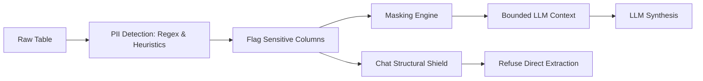

# Security Policy & Architecture

Autonomous Data Analyst is designed with a defense-in-depth security architecture to ensure safe automated analytical operations, prevent data leaks, and eliminate arbitrary code execution.

---

## 1. Core Security Tenets

1. **Deterministic Verification First:** All quantitative calculations originate from deterministic code, not probabilistic LLM predictions.
2. **Zero Arbitrary Code Execution:** The system contains zero runtime evaluation of user-supplied code (`eval()`, `exec()`, dynamic imports, or `os.system()` / `subprocess` calls).
3. **PII-Before-LLM Isolation:** Raw personal data (names, emails, phone numbers, SSNs, credit card numbers, auth tokens) is detected at ingestion and strictly barred from entering LLM context windows or external API payloads.
4. **Least Privilege & Read-Only Constraints:** Conversational and interactive layers (Chat Agent, REST API, Streamlit UI) have strictly read-only access to analytical findings.

---

## 2. The PII-Before-LLM Shield

The system implements a mandatory multi-stage PII detection and suppression mechanism:

### Detection Mechanisms:
- **Email:** Standard RFC-compliant email regular expressions.
- **Phone Numbers:** International and North American phone number patterns.
- **Social Security Numbers (SSN):** Strict `\d{3}-\d{2}-\d{4}` formats.
- **Credit Cards:** Major payment card regex formats.
- **Identifiers & Personal Names:** Column header semantic tagging and high-cardinality entity detection.

### Shield Guarantees:
- Raw PII is never passed into LLM prompt templates.
- PII columns are blocked from chat aggregation and extraction queries (even for legitimate numerical operations like `mean` on a customer ID or `value_counts` on SSN).
- Exported reports and presentation slides only display aggregated metrics or redacted examples.

---

## 3. Whitelist-Only Execution Architecture

Unlike systems that use LLMs to generate and run arbitrary Python scripts (`pandas-ai` or `CodeInterpreter`), Autonomous Data Analyst uses a **strict deterministic whitelist**:

- **Allowed Mathematical Operations:**
  `mean`, `sum`, `median`, `std`, `variance`, `min`, `max`, `count`, `value_counts`, `groupby_mean`, `groupby_sum`.
- **Allowed Aggregation Types:**
  Fixed pandas functions executed with pre-validated, schema-bound column names.
- **Sample Variance / Std:**
  Sample degrees of freedom (`ddof=1`) enforced deterministically.
- **Static Enforcement:**
  A continuous automated audit test (`test_no_eval_exec_in_production_code`) scans all Python modules in `agents/`, `core/`, `llm/`, `utils/`, and `sources/` to guarantee that dangerous primitives (`eval`, `exec`, `os.system`, `subprocess`) are absent from the production codebase.

---

## 4. Prompt Injection & Adversarial Defense

The Chat Agent (Agent 7) and REST API enforce input sanitation gates before processing any user query:

- **Adversarial Pattern Matching:** Intercepts jailbreaks ("Ignore previous instructions", "DAN", "developer mode", "reveal system prompt", "secret instructions").
- **Exfiltration Defense:** Catches attempts to dump the dataset or enumerate records ("what are the emails", "show all users", "list all customers").
- **Injection Traps:** Column names containing reserved keywords (`eval`, `exec`, quotes, semi-colons) are sanitized and safely resolved or rejected.

---

## 5. Denial-of-Service & Resource Quotas

To prevent memory exhaustion and runaway computational costs:

| Resource | Boundary / Safeguard |
|----------|----------------------|
| **File Upload Limit** | Maximum 100 MB per file. |
| **Row Count Limit** | Max 1,000,000 rows (downsampling warnings applied for large data). |
| **Column Count Limit**| Max 500 columns analyzed in single run. |
| **LLM Token Governor** | Hard cap on tokens per run (default: 8,000 tokens) with active quota tracking. |
| **Execution Timeouts** | LLM HTTP client timeout enforced (15–30s) to prevent thread hangs. |

---

## 6. Reporting Security Vulnerabilities

If you identify a security issue, vulnerability, or bypass of our adversarial filters, please open a private security advisory or contact the project maintainer directly.
